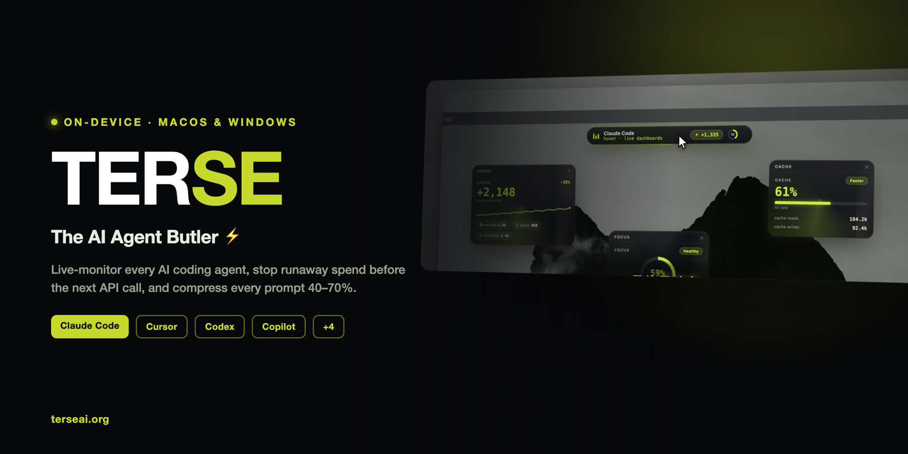
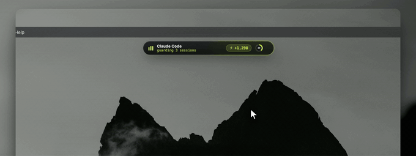
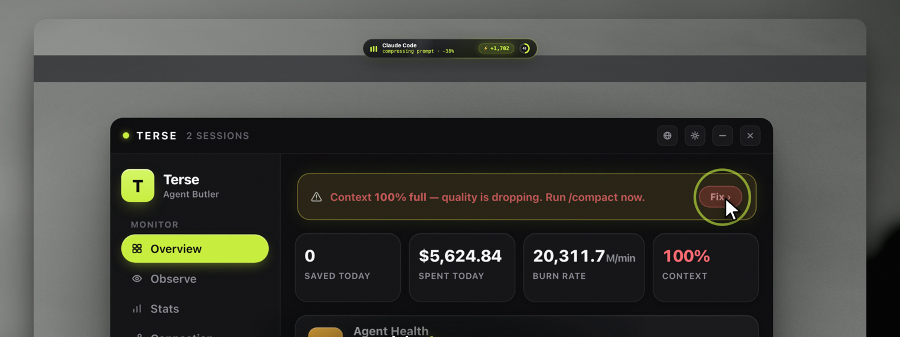
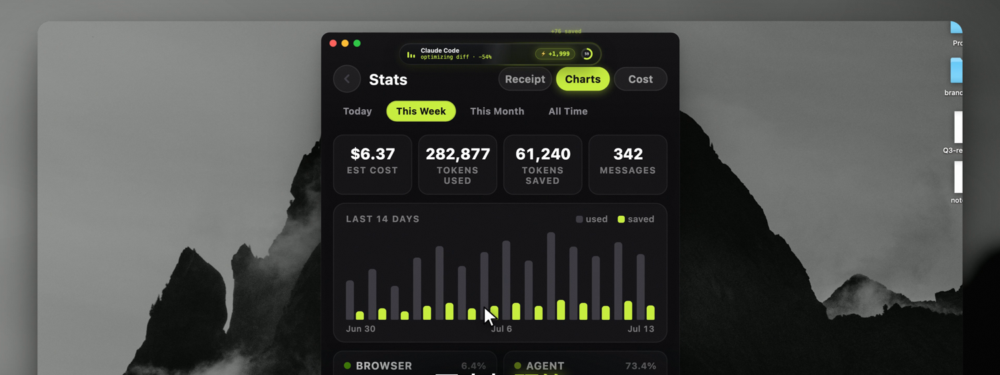
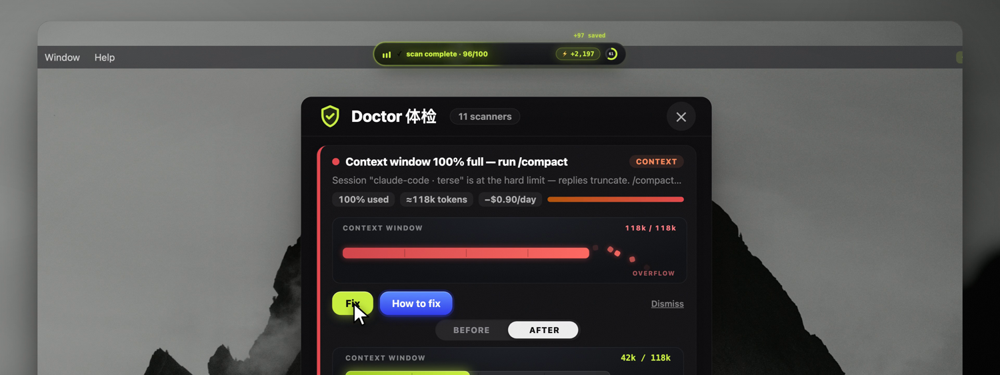
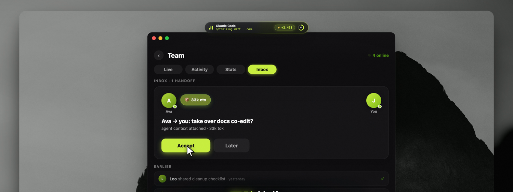

# Terse — The AI Agent Butler

**Live-monitor every AI coding agent, stop runaway spend before the next API call, and compress every prompt 40–70%. On-device, for macOS &amp; Windows.**

 

[**🌐 terseai.org**](https://www.terseai.org) &nbsp;·&nbsp; [**⬇️ Download**](https://github.com/lucaszengool/Terse/releases/latest) &nbsp;·&nbsp; [**📖 Docs**](https://www.terseai.org/blog) &nbsp;·&nbsp; [**💸 Token calculator**](https://www.terseai.org/token-calculator)

 

---

**[What is Terse?](#what-is-terse)** · **[See it](#see-it)** · **[Capabilities](#capabilities)** · **[Agents](#supported-agents)** · **[Download](#download)** · **[Why](#why-it-matters)** · **[FAQ](#faq)** · **[SDK](#for-developers--the-terse-sdk)**

---

## What is Terse?

**Terse is an on-device AI agent butler for macOS and Windows** (with Chrome and VS Code extensions). It watches the AI coding agents you already run — **Claude Code, Cursor, Codex, Copilot, Cline, Windsurf, OpenClaw, and Aider** — and handles the parts that quietly cost you money:

- **Compresses every prompt 40–70%** before it hits the API, meaning preserved.
- **Monitors each agent live** — tokens, cost, cache efficiency, burn rate, context fill.
- **Stops runaway agents** with a budget circuit breaker that pauses or kills the process *before* the next API call.
- **Manages your MCP servers** — discover, risk-score, and toggle without editing JSON.
- **Diagnoses waste** with 25 one-click Doctor scans.

Everything runs locally. Your prompts and sessions never leave your machine.

> **⭐ If Terse saves you tokens, drop a star — it's the fastest way to help other developers find it.**

---

## See it

<table>
<tr>
<td width="50%"></td>
<td width="50%"></td>
</tr>
<tr>
<td align="center"><b>Overview dashboard</b> Agent health, spend, burn rate &amp; context at a glance.</td>
<td align="center"><b>Token receipts &amp; charts</b> See exactly where your tokens and dollars go.</td>
</tr>
<tr>
<td width="50%"></td>
<td width="50%"></td>
</tr>
<tr>
<td align="center"><b>Doctor — 25 waste scans</b> Context overflow, duplicate MCP servers, one-click fixes.</td>
<td align="center"><b>Team collaboration</b> Share live agent sessions and hand off work.</td>
</tr>
</table>

---

## Capabilities

| | Pillar | What it does | Learn more |
|---|---|---|---|
| ⚡ | **Optimize** | Compress every prompt 40–70% — 35+ on-device techniques, code always protected. | [Token optimization →](https://www.terseai.org/what-is-token-optimization) |
| 📡 | **Monitor** | Live tokens, cost, cache efficiency, burn rate & context fill across 8 agents. | [For Claude Code →](https://www.terseai.org/for-claude-code) |
| 🛑 | **Budget breaker** | Spend ceilings that pause or kill a runaway agent *before* its next API call. | [Budget circuit breaker →](https://www.terseai.org/agent-budget-circuit-breaker) |
| 🔌 | **MCP manager** | Discover every MCP server, risk-score each, toggle without editing JSON. | [MCP manager →](https://www.terseai.org/mcp-manager) |
| 🩺 | **Doctor** | 25 waste scans — cache thrash, duplicate calls, redundant reads, context burn. | [Reduce AI API costs →](https://www.terseai.org/reduce-ai-api-costs) |
| 👥 | **Team** | Share live agent sessions and team analytics by developer, project, and tool. | [For teams →](https://www.terseai.org/teams) |

---

## Supported agents

Auto-detected, no setup:

**Claude Code** · **Cursor** · **OpenAI Codex** · **GitHub Copilot CLI** · **Cline** · **Windsurf** · **OpenClaw** · **Aider**

Claude Code goes deepest: exact token counts, cache read/write efficiency, live JSONL streaming, and 30 days of historical backfill.

---

## Download

| Platform | |
|---|---|
| 🍎 **macOS** | [Download the latest `.dmg`](https://github.com/lucaszengool/Terse/releases/latest) |
| 🪟 **Windows** | [Terse for Windows](https://www.terseai.org/for-windows) |
| 🧩 **Chrome** | [Chrome Web Store](https://chromewebstore.google.com/detail/lgnkdlpgfcogkmdhckmglleigmnnmmff) — compress prompts in any AI chat |
| 💻 **VS Code** | [VS Code Marketplace](https://marketplace.visualstudio.com/items?itemName=LucasZeng.terse-optimizer) — monitor agents + optimize in-editor |

Free 30-day trial · Monthly $4.99/mo · [pricing](https://www.terseai.org/#pricing)

---

## Why it matters

| Without Terse | With Terse |
|---|---|
| Prompts sent full-length, every token billed | 40–70% smaller prompts, meaning intact |
| No idea what an agent is spending until the bill | Live per-turn cost, burn rate, context fill |
| A looping agent can burn $100s overnight | Hard budget ceiling pauses/kills before the next call |
| MCP tool bloat silently taxes every call | Discover, risk-score & disable unused MCP servers |
| Duplicate tool calls & re-reads go unnoticed | Doctor flags them with one-click fixes |
| Your prompts leave your machine | 100% on-device — nothing leaves your Mac/PC |

---

## Three optimization modes

Code blocks, file paths, and technical terms are **always** protected.

- **Soft** — typo correction + whitespace only. 100% meaning-safe.
- **Normal** — removes filler, hedging, politeness padding, meta-language.
- **Aggressive** — maximum compression: abbreviations, article removal, telegraph style.

Grounded in real research — [LLMLingua](https://www.terseai.org/llmlingua), Norvig spelling, and selective-context pruning.

---

## Learn more

**Guides:** [What is token optimization](https://www.terseai.org/what-is-token-optimization) · [Reduce AI API costs](https://www.terseai.org/reduce-ai-api-costs) · [Claude Code pricing 2026](https://www.terseai.org/claude-code-pricing) · [AI token pricing comparison](https://www.terseai.org/ai-token-pricing-comparison) · [Blog](https://www.terseai.org/blog)

**Compare:** [Cursor vs Claude Code](https://www.terseai.org/cursor-vs-claude-code) · [Claude Code vs Copilot](https://www.terseai.org/claude-code-vs-github-copilot) · [Windsurf vs Claude Code](https://www.terseai.org/windsurf-vs-claude-code) · [AI coding agent costs](https://www.terseai.org/ai-coding-agent-costs)

**Per-tool:** [Claude Code](https://www.terseai.org/for-claude-code) · [Cursor](https://www.terseai.org/for-cursor) · [ChatGPT](https://www.terseai.org/for-chatgpt) · [Copilot](https://www.terseai.org/for-github-copilot) · [Aider](https://www.terseai.org/for-aider) · [Cline](https://www.terseai.org/for-cline) · [Windsurf](https://www.terseai.org/for-windsurf) · [Codex](https://www.terseai.org/for-codex-cli)

---

## FAQ

<b>How does Terse reduce AI agent costs?</b>

Terse compresses every prompt 40–70% on-device before it reaches the API, monitors each agent's live token/cost/cache usage, stops runaway agents with a budget circuit breaker, and flags waste (duplicate tool calls, redundant file reads, MCP tool bloat) with Terse Doctor. Together these cut the tokens you're billed for without changing how you work.

<b>Which AI coding agents does it work with?</b>

Terse auto-detects and monitors 8 agents: Claude Code, Cursor, OpenAI Codex, GitHub Copilot CLI, Cline, Windsurf, OpenClaw, and Aider. Claude Code has the deepest integration (exact token counts, cache efficiency, live JSONL streaming, 30-day history). The prompt optimizer works with any AI chat or agent.

<b>What is the budget circuit breaker?</b>

A hard spending limit for your agents. Set a burn-rate, token, or dollar ceiling and Terse escalates from an alert to pausing (SIGSTOP) or killing (SIGTERM) the agent process **before the next API call** — so a looping agent can't burn hundreds of dollars overnight.

<b>Does my prompt or code leave my machine?</b>

No. All compression and analysis run locally in a Rust/JavaScript engine. Your prompts and conversations are never sent to Terse's servers. Optional sign-in only enables subscription and team-sync features.

<b>Will compression change the meaning of my prompts?</b>

In Soft and Normal modes, meaning is fully preserved — code blocks, file paths, and technical terms are always protected. Aggressive mode maximizes savings (abbreviations, article removal, telegraph style) for when you want the smallest possible prompt.

<b>Is Terse free? How much does it cost?</b>

There's a free 30-day trial. After that it's $4.99/month. The macOS and Windows apps, plus the Chrome and VS Code extensions, all share the same optimizer.

<b>What is an MCP manager and why do I need one?</b>

Model Context Protocol (MCP) servers add tools to your agent — but bloated or unused tool catalogs quietly add hundreds of tokens to every call, and some servers carry security risk (remote transport, embedded credentials, code execution). Terse discovers every MCP server across your Claude Code / Cursor / Windsurf configs, risk-scores each, and lets you enable or disable them without editing JSON.

---

## For developers — the Terse SDK

This repo also contains the **Terse SDK**, a token-optimization framework for building cost-aware LLM apps (context compression, selective/verbatim compressors, working & episodic memory).

📖 **[Full SDK reference → SDK.md](SDK.md)** · [`examples/`](examples) · [`benchmark/`](benchmark) · [Contributing](CONTRIBUTING.md)

> The `@terse-ai/sdk` npm package isn't published yet — install from source by cloning this repo.

---

## Privacy

All compression and analysis happen **on your device** (Rust/JS engine). Your prompts and conversations are never sent to Terse's servers. Optional sign-in enables subscription and team-sync only.

 

**If Terse cuts your bill, [⭐ star the repo](https://github.com/Terse-AI/terseai) and tell a teammate.**

 

**[terseai.org](https://www.terseai.org)** · Built with Tauri · Rust · Swift

