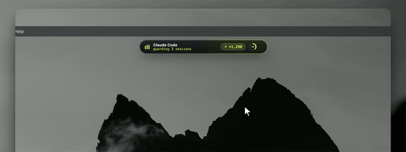
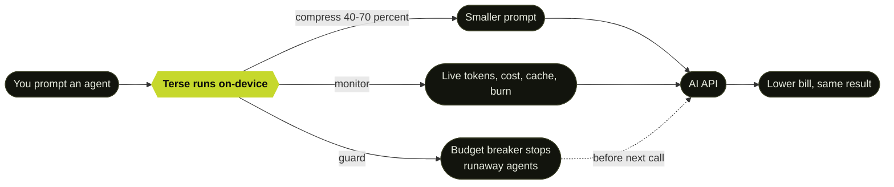
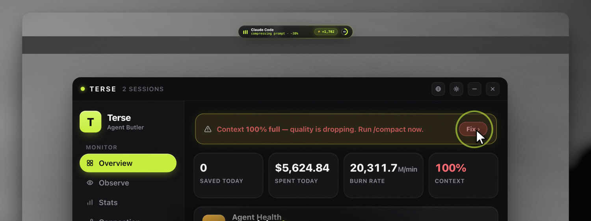
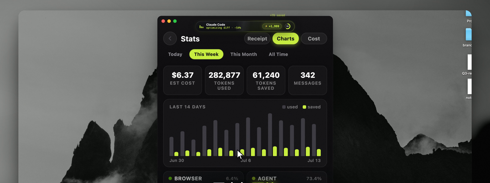
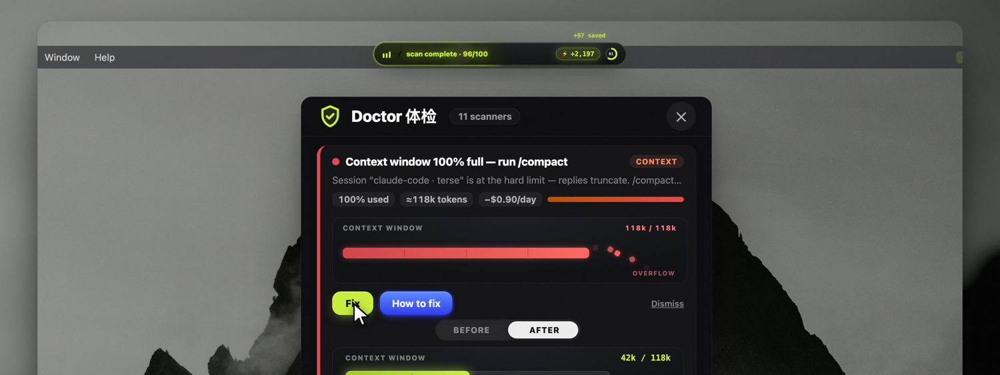
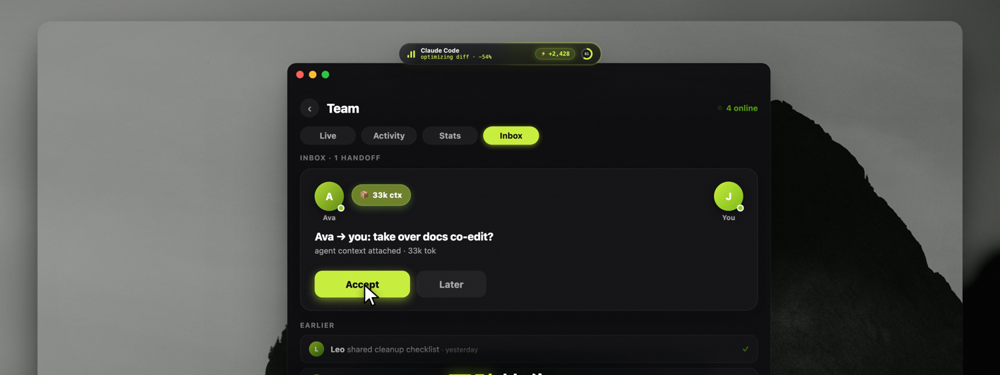
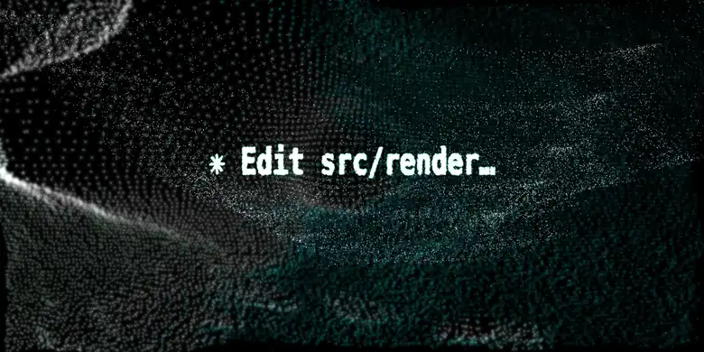
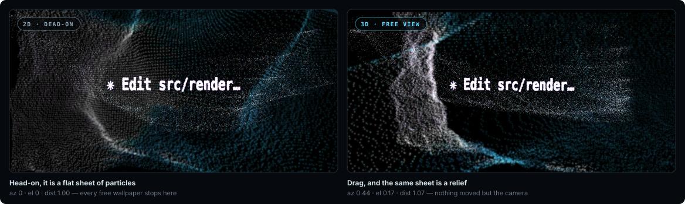
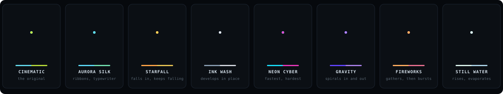

<div align="center">

<a href="https://www.terseai.org"></a>

# Terse — the AI agent butler

**Cut AI coding agent costs 40–70%.** Live-monitor Claude Code, Cursor, Codex and Copilot, stop runaway agents *before the next API call*, and compress every prompt on-device — then watch the whole thing happen on a **live 3D particle wallpaper** that spells out what your agents are doing. macOS &amp; Windows.

<br>

[](https://github.com/Terse-AI/terseai)
[](https://github.com/lucaszengool/Terse/releases/latest)
[](https://chromewebstore.google.com/detail/lgnkdlpgfcogkmdhckmglleigmnnmmff)
[](https://marketplace.visualstudio.com/items?itemName=LucasZeng.terse-optimizer)

[](https://github.com/Terse-AI/terseai/actions/workflows/ci.yml)


[](LICENSE)
[](https://github.com/Terse-AI/terseai/commits)

[**🌐 terseai.org**](https://www.terseai.org) &nbsp;·&nbsp; [**⬇️ Download**](https://github.com/lucaszengool/Terse/releases/latest) &nbsp;·&nbsp; [**📖 Docs**](https://www.terseai.org/blog) &nbsp;·&nbsp; [**💸 Token calculator**](https://www.terseai.org/token-calculator) &nbsp;·&nbsp; [**⚖️ vs ccusage &amp; others**](docs/COMPARISON.md)

<br>



</div>

---

<div align="center">

**[What is it?](#what-is-terse)** · **[Quickstart](#quickstart)** · **[See it](#see-it)** · **[✨ Live wallpaper](#live-wallpaper)** · **[Capabilities](#capabilities)** · **[Agents](#which-ai-coding-agents-does-terse-monitor)** · **[vs alternatives](#how-is-terse-different-from-ccusage-and-usage-dashboards)** · **[FAQ](#faq)** · **[SDK](#the-terse-sdk-mit)**

</div>

---

## What is Terse?

**Terse** (the tool at [terseai.org](https://www.terseai.org)) **is an on-device AI agent butler for macOS and Windows**, with Chrome and VS Code extensions. It watches the AI coding agents you already run — **Claude Code, Cursor, OpenAI Codex, GitHub Copilot CLI, Cline, Windsurf, OpenClaw and Aider** — and handles the parts that quietly cost you money:

- **Compresses every prompt 40–70%** before it hits the API, meaning preserved. 35+ techniques, sub-5ms, code always protected.
- **Monitors each agent live** — tokens, cost, cache read/write efficiency, burn rate, context fill.
- **Stops runaway agents** with a budget circuit breaker that pauses (`SIGSTOP`) or kills (`SIGTERM`) the process *before the next API call*.
- **Manages your MCP servers** — discover, risk-score and toggle without editing JSON.
- **Diagnoses waste** with ~25 one-click Terse Doctor scans.
- **Renders it all as a live wallpaper** — every agent action assembled out of particles on your desktop, in real 3D you can drag. [See it ↓](#live-wallpaper)

Everything runs locally. Your prompts and sessions never leave your machine.

This repository also holds the **[Terse SDK](#the-terse-sdk-mit)** (MIT) — the token-optimization framework the app is built on — and the [benchmark harness](benchmark) behind the 40–70% figure.

### How it works


```mermaid
flowchart LR
    U([You prompt an agent]) --> T{{Terse runs on-device}}
    T -->|compress 40-70 percent| S([Smaller prompt])
    T -->|monitor| M([Live tokens, cost, cache, burn])
    T -->|guard| B([Budget breaker stops<br/>runaway agents])
    S --> API([AI API])
    M --> API
    B -.->|before next call| API
    API --> W([Lower bill, same result])

    classDef terse fill:#c6d82c,stroke:#c6d82c,color:#0a0a0a,font-weight:bold;
    classDef node fill:#12140d,stroke:#3a3f26,color:#e8ece0;
    class T terse;
    class U,S,M,B,API,W node;
```

> **⭐ If Terse saves you tokens, drop a star — it's the fastest way to help other developers find it.**

---

## Quickstart

**The app** (monitoring, budget breaker, MCP manager, Doctor):

```bash
# macOS — download the signed .dmg
open https://github.com/lucaszengool/Terse/releases/latest
```

Windows build and extensions: see [Download](#download).

**The SDK** (build cost-aware LLM apps yourself — MIT licensed):

```bash
git clone https://github.com/Terse-AI/terseai.git
cd terseai
npm run benchmark      # reproduce the 40-70% numbers on your own machine
npm test               # 9 behavioural tests over the public API
```

```js
import { TerseContext } from './src/index.js';

const ctx = new TerseContext({
  model: 'claude-sonnet-4-6',
  budget: 8000,              // hard token ceiling for the context window
  compression: 'balanced',   // 'soft' | 'balanced' | 'aggressive'
});

const result = await ctx.chat([{ role: 'user', content: 'Explain recursion.' }]);
```

> The `@terse-ai/sdk` npm package isn't published yet — install from source by cloning this repo.

---

## See it

<table>
<tr>
<td width="50%"></td>
<td width="50%"></td>
</tr>
<tr>
<td align="center"><b>Overview dashboard</b><br>Agent health, spend, burn rate &amp; context at a glance.</td>
<td align="center"><b>Token receipts &amp; charts</b><br>See exactly where your tokens and dollars go.</td>
</tr>
<tr>
<td width="50%"></td>
<td width="50%"></td>
</tr>
<tr>
<td align="center"><b>Doctor — ~25 waste scans</b><br>Context overflow, duplicate MCP servers, one-click fixes.</td>
<td align="center"><b>Team collaboration</b><br>Share live agent sessions and hand off work.</td>
</tr>
</table>

---

<div align="center">

<a id="live-wallpaper"></a>

## ✨ The live wallpaper — your agent log, as 3D particles

**Terse's other half is a wallpaper.** Every action your agent takes is sampled into particles,
assembled into readable text on your desktop, held for a beat, then scattered back into the field.
Nothing here is a mockup — this is the shipping WebGL engine, recorded frame by frame.



<sub><b>2D → 3D.</b> The camera starts dead-on, then orbits. Nothing about the field changed — you were looking straight down it.</sub>

</div>

<br>

### It is made of your desktop, not drawn on top of it

The engine takes your **actual desktop picture** and rebuilds it out of tens of thousands of particles: each one
samples a pixel for its colour, and a depth map pushes it out of the plane. Head-on that reads as a
flat wallpaper. The moment the camera moves, the relief that was always there becomes visible.



Three layers, one renderer:

| Layer | What it is | Where it lives |
|---|---|---|
| **SILK** | Your desktop picture as particles, pushed into relief by an edge/depth map | A plane, sampled per-pixel |
| **PULSE** | The aurora shell — ribbons and depth sparks that carry the token traffic | `z ∈ −32…18`, real volume |
| **GLYPH** | The text: your agent's current action, token counts, teammates' lines | Assembled, held, scattered |

### The motion is your token traffic, not a screensaver

There is no audio and no random number driving any of this. The choreography is fed from the same
data the Dynamic Island shows:

- **Aggregate burn rate → field activity.** Idle agents leave a calm field; a busy one turns it into weather.
- **Every token event → a ripple**, pushed from the exact point the number landed.
- **Each log line → a glyph formation.** `Edit src/renderer/wallpaper.js` becomes particles, holds ~1s, dissolves.
- **Your teammates' lines too** — in a shared room, each person's messages arrive on the field under their own colour.

### Drag it. It's a real camera.

3D free view is a genuine orbit camera over both layers, not a parallax trick:

| Gesture | What it does | Range |
|---|---|---|
| **Drag** | Orbit — azimuth and elevation | azimuth is unlimited; elevation clamped to ±66° |
| **Scroll / pinch** | Dolly in and out | `0.55×` … `2.6×` |
| **Double-click** | Back to dead-on, still in 3D | — |

Your camera is saved to `~/.terse/wallpaper.json` as `view3d: {az, el, dist}` and restored on the
next login. On the desktop itself, a button beside the Dynamic Island hands you the wallpaper for as
long as you want it — press it again (or `Esc`) and the mouse goes straight back to your files. A
native 75-second watchdog gives it back even if the page dies.

### Eight Pro styles — and each one moves differently

A style is not a colour swap. It changes the palette, the choreography of the surrounding field, and
**how text gathers and scatters** — drawn from nine formation moves and ten field choreographies, dealt
from a shuffled bag so no two lines arrive the same way.



<sub>Each card's letter is assembled with that style's own move: Starfall drops it in from above and keeps it falling, Ink Wash develops it in place, Neon Cyber snaps it on and shatters it, Still Water floats it up and evaporates it.</sub>

### Point it at a project

Give the wallpaper a project folder and it scans it into a **capsule** — title, cover, language
breakdown, a few facts — and plays it as a ~20-second particle portrait: the cover image reassembled
from particles, the title and stats forming out of the same field. Capsules are 8–25 KB of JSON, so
publishing one to the plaza sends **parameters, not pixels** — everyone else's machine renders it
from scratch, in their own style.

<table>
<tr><td><b>Free</b></td><td>The live field, your desktop picture, the log line, the stats. Dead-on camera.</td></tr>
<tr><td><b>Pro</b></td><td>Eight styles + custom tuning, multi-slot glyphs, 3D free view, project capsules and the plaza.</td></tr>
</table>

<div align="center">

**[⬇️ Get it for macOS](https://github.com/lucaszengool/Terse/releases/latest)** &nbsp;·&nbsp; **[🪟 Windows](https://www.terseai.org/for-windows)** &nbsp;·&nbsp; **[⭐ Star the repo](https://github.com/Terse-AI/terseai)**

</div>


---

## Capabilities

| | Pillar | What it does | Learn more |
|---|---|---|---|
| ⚡ | **Optimize** | Compress every prompt 40–70% — 35+ on-device techniques, code always protected. | [Token optimization →](https://www.terseai.org/what-is-token-optimization) |
| 📡 | **Monitor** | Live tokens, cost, cache efficiency, burn rate & context fill across 8 agents. | [For Claude Code →](https://www.terseai.org/for-claude-code) |
| 🛑 | **Budget breaker** | Spend ceilings that pause or kill a runaway agent *before* its next API call. | [Budget circuit breaker →](https://www.terseai.org/agent-budget-circuit-breaker) |
| 🔌 | **MCP manager** | Discover every MCP server, risk-score each, toggle without editing JSON. | [MCP manager →](https://www.terseai.org/mcp-manager) |
| 🩺 | **Doctor** | ~25 waste scans — cache thrash, duplicate calls, redundant reads, context burn. | [Reduce AI API costs →](https://www.terseai.org/reduce-ai-api-costs) |
| 👥 | **Team** | Share live agent sessions and team analytics by developer, project, and tool. | [For teams →](https://www.terseai.org/teams) |
| ✨ | **Live wallpaper** | Your agents' actions assembled out of particles on the desktop — a real 3D field you can drag. | [See it ↑](#live-wallpaper) |

---

## Which AI coding agents does Terse monitor?

Eight, auto-detected with no setup:

**Claude Code** · **Cursor** · **OpenAI Codex** · **GitHub Copilot CLI** · **Cline** · **Windsurf** · **OpenClaw** · **Aider**

Claude Code goes deepest: exact token counts, cache read/write efficiency, live JSONL streaming, and 30 days of historical backfill. The prompt optimizer works with any AI chat or agent, including ones not on this list.

---

## How is Terse different from ccusage and usage dashboards?

Most tools in this space **report** what you spent. Terse is built to **change** it — compression before the call, and a circuit breaker that stops the process before the next one.

| | **Terse** | ccusage | Claude-Code-Usage-Monitor | Provider dashboards |
|---|---|---|---|---|
| Reports past spend | ✅ | ✅ | ✅ | ✅ |
| Live burn rate & context fill | ✅ | ⚠️ | ✅ | ❌ |
| **Stops a runaway agent** | ✅ pause/kill | ❌ | ⚠️ warns | ❌ |
| **Compresses prompts** | ✅ 40–70% | ❌ | ❌ | ❌ |
| MCP manager + risk score | ✅ | ❌ | ❌ | ❌ |
| Waste diagnosis | ✅ ~25 scans | ❌ | ❌ | ❌ |

**→ [Full comparison, including when to use something else](docs/COMPARISON.md)** — ccusage is free, excellent and one command away if all you need is a number.

---

## Download

| Platform | |
|---|---|
| 🍎 **macOS** | [Download the latest `.dmg`](https://github.com/lucaszengool/Terse/releases/latest) |
| 🪟 **Windows** | [Terse for Windows](https://www.terseai.org/for-windows) |
| 🧩 **Chrome** | [Chrome Web Store](https://chromewebstore.google.com/detail/lgnkdlpgfcogkmdhckmglleigmnnmmff) — compress prompts in any AI chat |
| 💻 **VS Code** | [VS Code Marketplace](https://marketplace.visualstudio.com/items?itemName=LucasZeng.terse-optimizer) — monitor agents + optimize in-editor |
| 📦 **SDK** | `git clone https://github.com/Terse-AI/terseai.git` — MIT, Node 18+ |

App: free 30-day trial · $4.99/mo · [pricing](https://www.terseai.org/#pricing). SDK: free, MIT.

---

## Why it matters

| Without Terse | With Terse |
|---|---|
| Prompts sent full-length, every token billed | 40–70% smaller prompts, meaning intact |
| No idea what an agent is spending until the bill | Live per-turn cost, burn rate, context fill |
| A looping agent can burn $100s overnight | Hard ceiling pauses/kills before the next call |
| MCP tool bloat silently taxes every call | Discover, risk-score & disable unused MCP servers |
| Duplicate tool calls & re-reads go unnoticed | Doctor flags them with one-click fixes |
| Your prompts leave your machine | 100% on-device — nothing leaves your Mac/PC |
| You find out what an agent did by reading a log | Your desktop spells it out in particles as it happens |

---

## Three optimization modes

Code blocks, file paths, and technical terms are **always** protected.

- **Soft** — typo correction + whitespace only. 100% meaning-safe.
- **Normal** — removes filler, hedging, politeness padding, meta-language.
- **Aggressive** — maximum compression: abbreviations, article removal, telegraph style.

Grounded in real research — [LLMLingua](https://www.terseai.org/llmlingua), Norvig spelling, and selective-context pruning.

---

## Learn more

**Guides:** [What is token optimization](https://www.terseai.org/what-is-token-optimization) · [Reduce AI API costs](https://www.terseai.org/reduce-ai-api-costs) · [Claude Code pricing 2026](https://www.terseai.org/claude-code-pricing) · [AI token pricing comparison](https://www.terseai.org/ai-token-pricing-comparison) · [Blog](https://www.terseai.org/blog)

**Compare:** [Cursor vs Claude Code](https://www.terseai.org/cursor-vs-claude-code) · [Claude Code vs Copilot](https://www.terseai.org/claude-code-vs-github-copilot) · [Windsurf vs Claude Code](https://www.terseai.org/windsurf-vs-claude-code) · [AI coding agent costs](https://www.terseai.org/ai-coding-agent-costs)

**Per-tool:** [Claude Code](https://www.terseai.org/for-claude-code) · [Cursor](https://www.terseai.org/for-cursor) · [ChatGPT](https://www.terseai.org/for-chatgpt) · [Copilot](https://www.terseai.org/for-github-copilot) · [Aider](https://www.terseai.org/for-aider) · [Cline](https://www.terseai.org/for-cline) · [Windsurf](https://www.terseai.org/for-windsurf) · [Codex](https://www.terseai.org/for-codex-cli)

**In this repo:** [FAQ](docs/FAQ.md) · [Comparison](docs/COMPARISON.md) · [SDK reference](SDK.md) · [Examples](examples) · [Benchmark](benchmark) · [llms.txt](llms.txt)

---

## FAQ

<details>
<summary><b>How do I reduce Claude Code costs?</b></summary>

Four levers, roughly in order of impact: send fewer tokens (Terse compresses every prompt 40–70% on-device); stop paying for cache misses (Doctor flags cache thrash — reordering a session so the stable prefix stays stable often beats compression); cut MCP tool bloat (unused servers re-send their catalogs on every call); and cap the downside with a hard ceiling, because most large bills are one unwatched loop. [More →](docs/FAQ.md)
</details>

<details>
<summary><b>Which AI coding agents does it work with?</b></summary>

Terse auto-detects and monitors 8 agents: Claude Code, Cursor, OpenAI Codex, GitHub Copilot CLI, Cline, Windsurf, OpenClaw, and Aider. Claude Code has the deepest integration (exact token counts, cache efficiency, live JSONL streaming, 30-day history). The prompt optimizer works with any AI chat or agent.
</details>

<details>
<summary><b>What is a budget circuit breaker?</b></summary>

A hard spending limit enforced at the process level rather than reported after the fact. Set a burn-rate, token, or dollar ceiling and Terse escalates from an alert to pausing (`SIGSTOP`) or killing (`SIGTERM`) the agent process **before the next API call** — so a looping agent can't burn hundreds of dollars overnight. Dashboards tell you the money is gone; a circuit breaker keeps it.
</details>

<details>
<summary><b>Does my prompt or code leave my machine?</b></summary>

No. All compression and analysis run locally in a Rust/JavaScript engine. Your prompts and conversations are never sent to Terse's servers. Optional sign-in only enables subscription and team-sync features.
</details>

<details>
<summary><b>Will compression change the meaning of my prompts?</b></summary>

In Soft and Normal modes, meaning is fully preserved — code blocks, file paths, and technical terms are always protected. Aggressive mode maximizes savings (abbreviations, article removal, telegraph style) for when you want the smallest possible prompt.
</details>

<details>
<summary><b>How much does Terse actually save — and can I verify it?</b></summary>

40–70% on verbose prompts, less on prompts that were already terse. You can reproduce the numbers yourself: `git clone https://github.com/Terse-AI/terseai.git && cd terseai && npm run benchmark`. It reports each module separately (text compression, working memory, tool optimization, model routing) rather than one headline number.
</details>

<details>
<summary><b>Is Terse free? How much does it cost?</b></summary>

The app has a free 30-day trial, then $4.99/month. The Chrome extension has a free tier. **The Terse SDK in this repository is MIT licensed and free**, benchmark harness included.
</details>

<details>
<summary><b>What is an MCP manager and why do I need one?</b></summary>

Model Context Protocol (MCP) servers add tools to your agent — but bloated or unused tool catalogs quietly add hundreds of tokens to every call, and some servers carry security risk (remote transport, embedded credentials, code execution, unpinned supply chain). Terse discovers every MCP server across your Claude Code / Cursor / Windsurf configs, risk-scores each, and lets you enable or disable them without editing JSON.
</details>

<details>
<summary><b>What is the live wallpaper, and does it slow my machine down?</b></summary>

It is a WebGL particle field that sits at the desktop window level — behind your icons, click-through, on every Space — and renders what your agents are doing right now: each log line is sampled into particles, assembled into readable text, held for about a second, then scattered back into the field. It is built from your own desktop picture (each particle takes a pixel's colour; a depth map gives the plane its relief), so turning the camera reveals real depth rather than a parallax trick. It runs at a capped 30fps and a capped pixel ratio, and the density is a slider in the control panel — turn it down, or turn the whole thing off. [More ↑](#live-wallpaper)
</details>

<details>
<summary><b>Does Terse work on Linux?</b></summary>

The desktop apps ship for macOS and Windows today. The Terse SDK in this repository is plain Node.js and runs anywhere Node 18+ runs, Linux included.
</details>

**→ [Full FAQ](docs/FAQ.md)**

---

## The Terse SDK (MIT)

This repo contains the **Terse SDK**, a token-optimization framework for building cost-aware LLM apps: context compression, selective/verbatim compressors, working & episodic memory, model routing, and MCP/tool-catalog optimization.

```js
import { linguisticCompress, optimizeTools, ModelRouter } from './src/index.js';
```

📖 **[Full SDK reference → SDK.md](SDK.md)** · [`examples/`](examples) · [`benchmark/`](benchmark) · [Contributing](CONTRIBUTING.md) · [License](LICENSE)

---

## Privacy

All compression and analysis happen **on your device** (Rust/JS engine). Your prompts and conversations are never sent to Terse's servers. Optional sign-in enables subscription and team-sync only.

<div align="center">
<br>

**If Terse cuts your bill, [⭐ star the repo](https://github.com/Terse-AI/terseai) and tell a teammate.**

<br>

**[terseai.org](https://www.terseai.org)** · Built with Tauri · Rust · Swift

</div>
