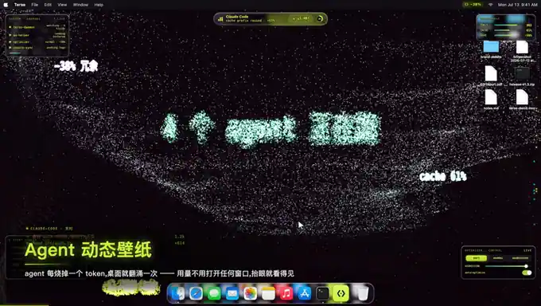
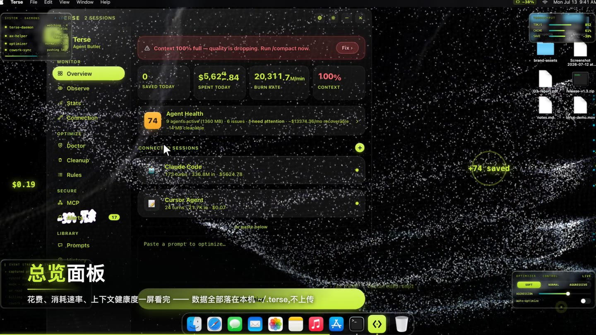
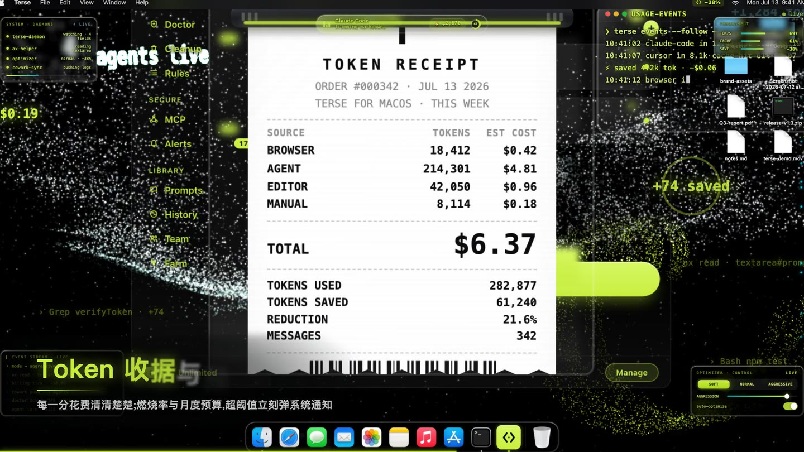
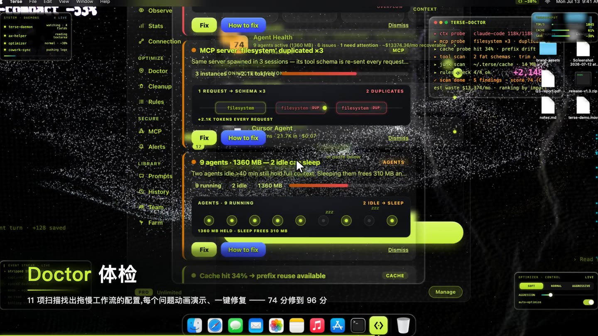
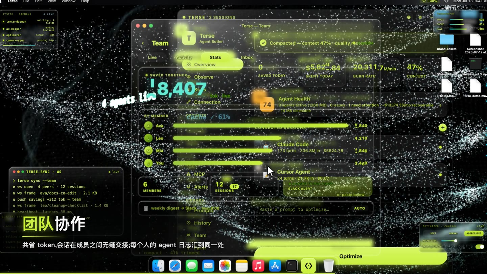

<div align="center">

<a href="README.md">English</a> &nbsp;·&nbsp; <b>简体中文</b>

</div>

<div align="center">

<a href="https://www.terseai.org"></a>

# Terse —— AI agent 管家

**把 AI 编程 agent 的成本砍掉 40–70%。** 实时监控 Claude Code、Cursor、Codex 和 Copilot，*在下一次 API 调用之前*掐掉失控的 agent，每条 prompt 都在本机压缩 —— 然后把这一切放到一张 **实时 3D 粒子壁纸** 上，让它把 agent 正在做的事写在你的桌面上。支持 macOS 与 Windows。

<br>

[](https://github.com/Terse-AI/terseai)
[](https://github.com/lucaszengool/Terse/releases/latest)
[](https://chromewebstore.google.com/detail/lgnkdlpgfcogkmdhckmglleigmnnmmff)
[](https://marketplace.visualstudio.com/items?itemName=LucasZeng.terse-optimizer)

[](https://github.com/Terse-AI/terseai/actions/workflows/ci.yml)


[](LICENSE)
[](https://github.com/Terse-AI/terseai/commits)

[**🌐 terseai.org**](https://www.terseai.org) &nbsp;·&nbsp; [**⬇️ 下载**](https://github.com/lucaszengool/Terse/releases/latest) &nbsp;·&nbsp; [**📖 文档**](https://www.terseai.org/blog) &nbsp;·&nbsp; [**💸 Token 计算器**](https://www.terseai.org/token-calculator) &nbsp;·&nbsp; [**⚖️ 对比 ccusage 等**](docs/COMPARISON.md)

<br>



<sub><b>这是桌面，不是播放器。</b> 壁纸正在渲染你的 agent 此刻在做什么 —— 而且它是一片真的能拖动的 3D 场。<a href="#live-wallpaper">它是怎么做的 ↓</a></sub>

</div>

---

<div align="center">

**[这是什么？](#what-is-terse)** · **[快速上手](#quickstart)** · **[看一眼](#see-it)** · **[✨ 动态壁纸](#live-wallpaper)** · **[能力](#capabilities)** · **[支持的 agent](#agents)** · **[和别的工具比](#vs-alternatives)** · **[常见问题](#faq)** · **[SDK](#sdk)**

</div>

---

<a id="what-is-terse"></a>

## Terse 是什么？

**Terse**（[terseai.org](https://www.terseai.org) 上的那个工具）**是一个跑在本机的 AI agent 管家**，支持 macOS 和 Windows，另有 Chrome 和 VS Code 扩展。它盯着你已经在用的那些 AI 编程 agent —— **Claude Code、Cursor、OpenAI Codex、GitHub Copilot CLI、Cline、Windsurf、OpenClaw 和 Aider** —— 并接手那些正在悄悄烧钱的环节：

- **每条 prompt 在发出前压缩 40–70%**，意思不变。35+ 种手法，耗时低于 5ms，代码永远受保护。
- **逐个 agent 实时监控** —— token、花费、缓存读写效率、烧钱速率、上下文占用。
- **掐掉失控的 agent**：预算断路器会*在下一次 API 调用之前*暂停（`SIGSTOP`）或杀掉（`SIGTERM`）那个进程。
- **管理你的 MCP server** —— 发现、风险评分、一键开关，不用手改 JSON。
- **诊断浪费**：约 25 项 Terse Doctor 体检，一键修复。
- **把这一切画成一张动态壁纸** —— agent 的每一个动作都由粒子在你桌面上聚成，而且是能拖的真 3D。[看一眼 ↓](#live-wallpaper)

一切都在本地运行。你的 prompt 和会话不会离开你的机器。

这个仓库同时也是 **[Terse SDK](#sdk)**（MIT 协议）—— app 本身就建立在这套 token 优化框架上 —— 以及支撑 40–70% 这个数字的 [benchmark 工具](benchmark)。

### 它是怎么工作的

<div align="center">

</div>

> **⭐ 如果 Terse 帮你省下了 token，点个 star —— 这是让更多开发者找到它最快的办法。**

---

<a id="quickstart"></a>

## 快速上手

**App**（监控、预算断路器、MCP 管理、Doctor）：

```bash
# macOS —— 下载已签名的 .dmg
open https://github.com/lucaszengool/Terse/releases/latest
```

Windows 版和各扩展见 [下载](#download)。

**SDK**（自己动手写省钱的 LLM 应用 —— MIT 协议）：

```bash
git clone https://github.com/Terse-AI/terseai.git
cd terseai
npm run benchmark      # 在你自己的机器上复现 40-70% 这个数字
npm test               # 9 个针对公开 API 的行为测试
```

```js
import { TerseContext } from './src/index.js';

const ctx = new TerseContext({
  model: 'claude-sonnet-4-6',
  budget: 8000,              // 上下文窗口的硬上限
  compression: 'balanced',   // 'soft' | 'balanced' | 'aggressive'
});

const result = await ctx.chat([{ role: 'user', content: 'Explain recursion.' }]);
```

> `@terse-ai/sdk` 这个 npm 包还没发布 —— 先 clone 本仓库从源码使用。

---

<a id="see-it"></a>

## 看一眼

下面每一张都是 app 跑在真实桌面上的画面 —— 窗口背后那一层，就是那张动态粒子壁纸，
它正在对窗口里报的同一批 token 流量作出反应。

<table>
<tr>
<td width="50%"></td>
<td width="50%"></td>
</tr>
<tr>
<td align="center"><b>总览面板</b><br>agent 健康度、花费、烧钱速率和上下文，一屏看完。</td>
<td align="center"><b>Token 收据与图表</b><br>按来源逐条算清。282,877 tokens，$6.37，省下 21.6%。</td>
</tr>
<tr>
<td width="50%"></td>
<td width="50%"></td>
</tr>
<tr>
<td align="center"><b>Doctor —— 约 25 项体检</b><br>重复的 MCP server、占着上下文空转的 agent，一键修复。</td>
<td align="center"><b>团队协作</b><br>会话实时共享、省量合并统计、工作可以中途交接。</td>
</tr>
</table>

---

<div align="center">

<a id="live-wallpaper"></a>

## ✨ 动态壁纸 —— 你的 agent 日志，变成 3D 粒子

**Terse 的另一半是一张壁纸。** agent 做的每一个动作都会被采样成粒子，在你的桌面上聚成能读的字，
停留一拍，再散回那片场里。这里没有一帧是示意图 —— 全部来自正在出货的那台 WebGL 引擎，逐帧录下来的。


<sub><b>2D → 3D。</b> 相机从正对开始，然后绕出去。场本身一点没变 —— 你之前只是正对着它的厚度在看。</sub>

</div>

<br>

### 它是用你的桌面做的，不是画在桌面上的

引擎拿你**当前那张真实桌面壁纸**，用几万颗粒子把它重建出来：每一颗取一个像素的颜色，
再由一张深度图把它推离平面。正对着看，那就是一张平的壁纸。相机一动，
那份一直都在的浮雕就现出来了。


三层，一台渲染器：

| 层 | 是什么 | 活在哪 |
|---|---|---|
| **SILK** | 你的桌面壁纸变成粒子，由边缘/深度图推成浮雕 | 一个平面，逐像素采样 |
| **PULSE** | 极光层 —— 承载 token 流量的丝带和深度火花 | `z ∈ −32…18`，真的有体积 |
| **GLYPH** | 那些字：agent 当前动作、token 数字、队友的发言 | 聚起来、停住、散开 |

### 那些律动来自你的 token 流量，不是屏保

这里没有音频，也没有任何随机数在驱动。整套编舞的输入，和灵动岛显示的是同一份数据：

- **总烧钱速率 → 场的活跃度。** agent 闲着，场就是平静的；一忙起来，它就变成天气。
- **每一笔 token → 一圈涟漪**，从那个数字落下的位置推出去。
- **每一条日志 → 一次成字。** `Edit src/renderer/wallpaper.js` 变成粒子，停约 1 秒，再化开。
- **队友的发言也一样** —— 在共享房间里，每个人的消息都会以他自己的颜色落到这片场上。

### 拖一下。那是一台真的相机。

3D 自由视角是一台真正绕着两层场转的轨道相机，不是视差障眼法：

| 手势 | 做什么 | 范围 |
|---|---|---|
| **拖动** | 转视角 —— 方位角与仰角 | 方位角不限；仰角夹在 ±66° |
| **滚轮 / 捏合** | 推近拉远 | `0.55×` … `2.6×` |
| **双击** | 回到正对机位，但仍在 3D 里 | —— |

你的机位会以 `view3d: {az, el, dist}` 存进 `~/.terse/wallpaper.json`，下次登录原样恢复。
在桌面上，灵动岛旁边有一颗钮，按下去这张壁纸就归你拖，想拖多久拖多久 ——
再按一次（或按 `Esc`）鼠标立刻还给你的文件。另有一道原生的 75 秒看门狗，
就算页面崩了也会把鼠标还回来。

### 八种 Pro 风格 —— 每一种的动法都不一样

风格不是换个配色。它同时改掉调色板、周围那片场的编舞，以及**字怎么聚、怎么散** ——
从九种成型手法和十段场编舞里，像洗牌一样一次摸一张，所以连着两条字都不会用同一种方式出现。


<sub>每张卡片上的字母都是用那种风格自己的手法聚出来的：Starfall 从上面砸下来、散的时候继续往下掉；Ink Wash 在原地显影；Neon Cyber 硬打上去再炸碎；Still Water 从下面浮起来，再蒸发掉。</sub>

### 把它指向一个项目

给壁纸一个项目文件夹，它会把这个项目扫成一颗**胶囊** —— 标题、封面、语言占比、几条事实 ——
再把它演成一段约 20 秒的粒子缩影：封面图由粒子重新聚起来，标题和统计从同一片场里浮出来。
一颗胶囊只有 8–25 KB 的 JSON，所以发到广场传的是**参数，不是画面** ——
别人的机器会用他自己的风格从头渲染一遍。

<table>
<tr><td><b>免费</b></td><td>实时的场、你自己的桌面壁纸、那条日志、那些统计。正对机位。</td></tr>
<tr><td><b>Pro</b></td><td>八种风格 + 自定义调参、多槽位字形、3D 自由视角、项目胶囊与广场。</td></tr>
</table>

<div align="center">

**[⬇️ 下载 macOS 版](https://github.com/lucaszengool/Terse/releases/latest)** &nbsp;·&nbsp; **[🪟 Windows](https://www.terseai.org/for-windows)** &nbsp;·&nbsp; **[⭐ 给仓库点个 star](https://github.com/Terse-AI/terseai)**

</div>

---

<a id="capabilities"></a>

## 能力

| | 支柱 | 做什么 | 了解更多 |
|---|---|---|---|
| ⚡ | **优化** | 每条 prompt 压缩 40–70% —— 35+ 种本机手法，代码永远受保护。 | [什么是 token 优化 →](https://www.terseai.org/what-is-token-optimization) |
| 📡 | **监控** | 8 个 agent 的实时 token、花费、缓存效率、烧钱速率与上下文占用。 | [给 Claude Code 用 →](https://www.terseai.org/for-claude-code) |
| 🛑 | **预算断路器** | 花费上限，*在下一次 API 调用之前*暂停或杀掉失控的 agent。 | [预算断路器 →](https://www.terseai.org/agent-budget-circuit-breaker) |
| 🔌 | **MCP 管理** | 发现每一个 MCP server、逐个风险评分、开关不用改 JSON。 | [MCP 管理 →](https://www.terseai.org/mcp-manager) |
| 🩺 | **Doctor** | 约 25 项体检 —— 缓存抖动、重复调用、冗余读取、上下文空烧。 | [降低 AI API 成本 →](https://www.terseai.org/reduce-ai-api-costs) |
| 👥 | **团队** | 共享实时 agent 会话，按人、按项目、按工具做团队分析。 | [给团队用 →](https://www.terseai.org/teams) |
| ✨ | **动态壁纸** | agent 的动作在桌面上由粒子聚成 —— 一片能拖的真 3D 场。 | [看一眼 ↑](#live-wallpaper) |

---

<a id="agents"></a>

## Terse 能监控哪些 AI 编程 agent？

八个，自动识别，零配置：

**Claude Code** · **Cursor** · **OpenAI Codex** · **GitHub Copilot CLI** · **Cline** · **Windsurf** · **OpenClaw** · **Aider**

其中 Claude Code 挖得最深：精确的 token 数、缓存读写效率、实时 JSONL 流，以及 30 天的历史回填。
prompt 优化器则对任何 AI 对话或 agent 都有效，包括不在这张名单上的。

---

<a id="vs-alternatives"></a>

## Terse 和 ccusage、和那些用量面板有什么不一样？

这个领域里大多数工具是**报告**你花了多少。Terse 是奔着**改变**它去的 ——
调用之前先压缩，以及一道在下一次调用之前就掐掉进程的断路器。

| | **Terse** | ccusage | Claude-Code-Usage-Monitor | 厂商面板 |
|---|---|---|---|---|
| 报告历史花费 | ✅ | ✅ | ✅ | ✅ |
| 实时烧钱速率与上下文占用 | ✅ | ⚠️ | ✅ | ❌ |
| **掐掉失控的 agent** | ✅ 暂停/杀掉 | ❌ | ⚠️ 只告警 | ❌ |
| **压缩 prompt** | ✅ 40–70% | ❌ | ❌ | ❌ |
| MCP 管理 + 风险评分 | ✅ | ❌ | ❌ | ❌ |
| 浪费诊断 | ✅ 约 25 项 | ❌ | ❌ | ❌ |

**→ [完整对比，包括什么时候该用别的工具](docs/COMPARISON.md)** ——
如果你要的只是一个数字，ccusage 免费、好用，一条命令就能跑。

---

<a id="download"></a>

## 下载

| 平台 | |
|---|---|
| 🍎 **macOS** | [下载最新 `.dmg`](https://github.com/lucaszengool/Terse/releases/latest) |
| 🪟 **Windows** | [Terse for Windows](https://www.terseai.org/for-windows) |
| 🧩 **Chrome** | [Chrome 应用商店](https://chromewebstore.google.com/detail/lgnkdlpgfcogkmdhckmglleigmnnmmff) —— 在任何 AI 对话里压缩 prompt |
| 💻 **VS Code** | [VS Code 市场](https://marketplace.visualstudio.com/items?itemName=LucasZeng.terse-optimizer) —— 编辑器内监控 agent + 优化 |
| 📦 **SDK** | `git clone https://github.com/Terse-AI/terseai.git` —— MIT，Node 18+ |

App：30 天免费试用 · $4.99/月 · [价格](https://www.terseai.org/#pricing)。SDK：免费，MIT。

---

## 为什么这件事重要

| 没有 Terse | 有了 Terse |
|---|---|
| prompt 原样发出去，每个 token 都计费 | prompt 小 40–70%，意思不变 |
| 账单来之前不知道 agent 在花多少 | 每一轮的花费、烧钱速率、上下文占用都是实时的 |
| 一个死循环的 agent 一夜能烧掉几百刀 | 硬上限会在下一次调用之前暂停/杀掉它 |
| MCP 工具膨胀在悄悄给每次调用加税 | 发现、风险评分、关掉用不上的 MCP server |
| 重复的工具调用和重复读取没人发现 | Doctor 把它们挑出来，一键修复 |
| 你的 prompt 离开了你的机器 | 100% 本机 —— 什么都不会离开你的 Mac/PC |
| 想知道 agent 干了什么，得去翻日志 | 你的桌面在它发生的同时就用粒子写出来了 |

---

## 三档优化模式

代码块、文件路径和技术术语**永远**受保护。

- **Soft** —— 只做错别字修正和空白压缩。100% 不改变意思。
- **Normal** —— 去掉废话、模棱两可的措辞、客套和元语言。
- **Aggressive** —— 压到最狠：缩写、去冠词、电报体。

背后是真实的研究 —— [LLMLingua](https://www.terseai.org/llmlingua)、Norvig 拼写纠错，以及选择性上下文裁剪。

---

## 了解更多

**指南：** [什么是 token 优化](https://www.terseai.org/what-is-token-optimization) · [降低 AI API 成本](https://www.terseai.org/reduce-ai-api-costs) · [Claude Code 2026 价格](https://www.terseai.org/claude-code-pricing) · [AI token 价格对比](https://www.terseai.org/ai-token-pricing-comparison) · [博客](https://www.terseai.org/blog)

**对比：** [Cursor vs Claude Code](https://www.terseai.org/cursor-vs-claude-code) · [Claude Code vs Copilot](https://www.terseai.org/claude-code-vs-github-copilot) · [Windsurf vs Claude Code](https://www.terseai.org/windsurf-vs-claude-code) · [AI 编程 agent 的成本](https://www.terseai.org/ai-coding-agent-costs)

**按工具：** [Claude Code](https://www.terseai.org/for-claude-code) · [Cursor](https://www.terseai.org/for-cursor) · [ChatGPT](https://www.terseai.org/for-chatgpt) · [Copilot](https://www.terseai.org/for-github-copilot) · [Aider](https://www.terseai.org/for-aider) · [Cline](https://www.terseai.org/for-cline) · [Windsurf](https://www.terseai.org/for-windsurf) · [Codex](https://www.terseai.org/for-codex-cli)

**本仓库内：** [FAQ](docs/FAQ.md) · [对比](docs/COMPARISON.md) · [SDK 参考](SDK.md) · [示例](examples) · [Benchmark](benchmark) · [llms.txt](llms.txt)

---

<a id="faq"></a>

## 常见问题

<details>
<summary><b>怎么降低 Claude Code 的花费？</b></summary>

四个杠杆，大致按影响排序：少发 token（Terse 在本机把每条 prompt 压 40–70%）；别为缓存未命中付钱（Doctor 会标出缓存抖动 —— 把一次会话重排成稳定前缀不变，往往比压缩还管用）；砍掉 MCP 工具膨胀（没用上的 server 每次调用都会把自己的工具清单重发一遍）；最后用一道硬上限把下限兜住，因为大额账单绝大多数来自一次没人看着的死循环。[更多 →](docs/FAQ.md)
</details>

<details>
<summary><b>它支持哪些 AI 编程 agent？</b></summary>

Terse 自动识别并监控 8 个：Claude Code、Cursor、OpenAI Codex、GitHub Copilot CLI、Cline、Windsurf、OpenClaw、Aider。其中 Claude Code 集成最深（精确 token 数、缓存效率、实时 JSONL 流、30 天历史）。prompt 优化器对任何 AI 对话或 agent 都有效。
</details>

<details>
<summary><b>什么是预算断路器？</b></summary>

一道在进程层面执行、而不是事后报告的硬性花费上限。你设一个烧钱速率、token 数或美元上限，Terse 会从告警一路升级到**在下一次 API 调用之前**暂停（`SIGSTOP`）或杀掉（`SIGTERM`）那个 agent 进程 —— 于是死循环的 agent 没机会一夜烧掉几百刀。面板告诉你钱已经没了；断路器是把钱留住。
</details>

<details>
<summary><b>我的 prompt 或代码会离开我的机器吗？</b></summary>

不会。所有压缩和分析都在本地的 Rust/JavaScript 引擎里跑。你的 prompt 和对话不会被发到 Terse 的服务器。可选的登录只用于订阅和团队同步。
</details>

<details>
<summary><b>压缩会不会改变 prompt 的意思？</b></summary>

Soft 和 Normal 两档下意思完全保留 —— 代码块、文件路径和技术术语永远受保护。Aggressive 追求最大压缩率（缩写、去冠词、电报体），留给你确实想把 prompt 压到最短的时候。
</details>

<details>
<summary><b>Terse 到底能省多少？我能自己验证吗？</b></summary>

啰嗦的 prompt 能省 40–70%，本来就写得很精炼的自然少一些。你可以自己复现：`git clone https://github.com/Terse-AI/terseai.git && cd terseai && npm run benchmark`。它会分模块分别报数（文本压缩、工作记忆、工具优化、模型路由），而不是给你一个笼统的标题数字。
</details>

<details>
<summary><b>Terse 免费吗？多少钱？</b></summary>

App 有 30 天免费试用，之后 $4.99/月。Chrome 扩展有免费档。**本仓库里的 Terse SDK 是 MIT 协议、完全免费的**，benchmark 工具也包含在内。
</details>

<details>
<summary><b>MCP 管理是什么，我为什么需要它？</b></summary>

MCP（Model Context Protocol）server 给你的 agent 增加工具 —— 但臃肿或没用上的工具清单会悄悄给每次调用加上几百个 token，而且有些 server 本身带着安全风险（远程传输、内嵌凭据、代码执行、没锁版本的供应链）。Terse 会跨你的 Claude Code / Cursor / Windsurf 配置找出每一个 MCP server，逐个打风险分，并让你不用改 JSON 就能开关它们。
</details>

<details>
<summary><b>那张动态壁纸是什么？会不会拖慢我的机器？</b></summary>

它是一片 WebGL 粒子场，待在桌面窗口层 —— 在你的图标后面、鼠标穿透、所有 Space 上都在 —— 渲染你的 agent 此刻在做什么：每条日志被采样成粒子，聚成能读的字，停约一秒，再散回场里。它是用你自己那张桌面壁纸做的（每颗粒子取一个像素的颜色，一张深度图给这个平面赋予浮雕），所以转动相机看到的是真实的深度，不是视差障眼法。它锁在 30fps、像素比也有上限，密度在控制面板里是一根滑杆 —— 调低它，或者干脆整个关掉。[更多 ↑](#live-wallpaper)
</details>

<details>
<summary><b>Terse 支持 Linux 吗？</b></summary>

桌面 app 目前发行 macOS 和 Windows 两个版本。本仓库里的 Terse SDK 是纯 Node.js，任何能跑 Node 18+ 的地方都能跑，Linux 包括在内。
</details>

**→ [完整 FAQ](docs/FAQ.md)**

---

<a id="sdk"></a>

## Terse SDK（MIT）

本仓库包含 **Terse SDK**，一套用来构建「省钱」LLM 应用的 token 优化框架：上下文压缩、
选择性/逐字压缩器、工作记忆与情景记忆、模型路由，以及 MCP/工具清单优化。

```js
import { linguisticCompress, optimizeTools, ModelRouter } from './src/index.js';
```

📖 **[完整 SDK 参考 → SDK.md](SDK.md)** · [`examples/`](examples) · [`benchmark/`](benchmark) · [贡献指南](CONTRIBUTING.md) · [许可证](LICENSE)

---

## 隐私

所有压缩和分析都发生在**你的设备上**（Rust/JS 引擎）。你的 prompt 和对话不会被发到 Terse 的服务器。
可选的登录仅用于订阅和团队同步。

<div align="center">
<br>

**如果 Terse 降低了你的账单，[⭐ 给仓库点个 star](https://github.com/Terse-AI/terseai)，再告诉一位同事。**

<br>

**[terseai.org](https://www.terseai.org)** · 由 Tauri · Rust · Swift 构建

</div>
